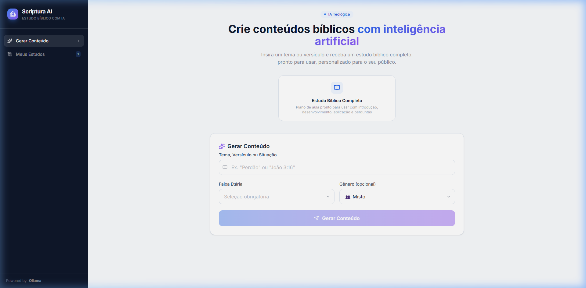
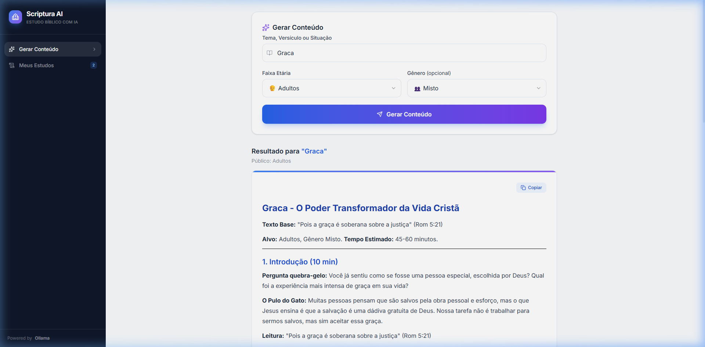
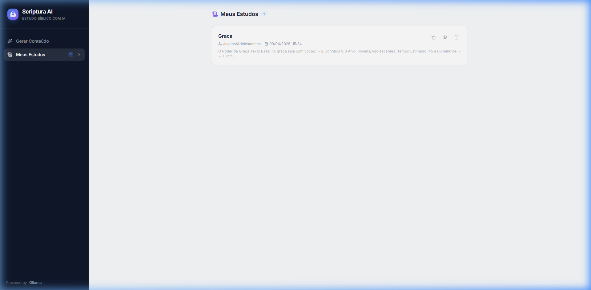
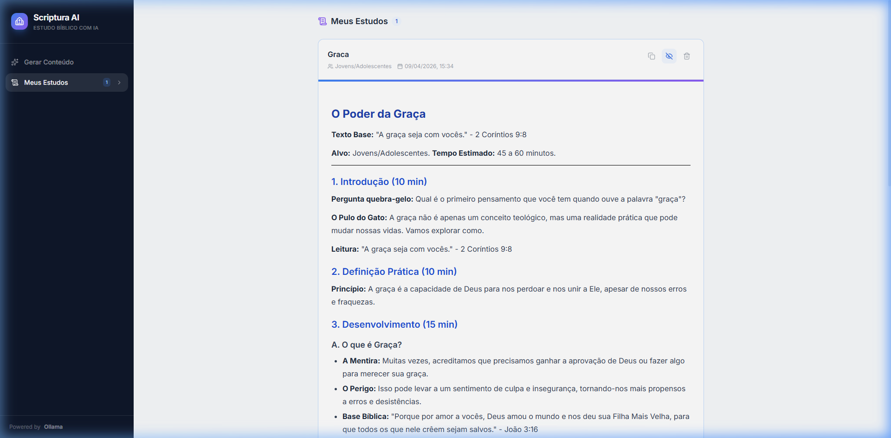

# ✝️ Scriptura AI — Plataforma de Estudos Bíblicos com IA

Uma plataforma educativa inovadora, baseada em Inteligência Artificial, desenvolvida para democratizar o acesso a estudos bíblicos profissionais e personalizados.

## 📖 Sobre o Projeto

Scriptura AI é um **Micro-SaaS** educacional que utiliza modelos avançados de Inteligência Artificial (Ollama / Groq) para atuar como um **teólogo-assistente inteligente**. O sistema gera estudos bíblicos completos — personalizados por tema, público-alvo e gênero — utilizando **RAG (Retrieval-Augmented Generation)** com busca vetorial semântica na Bíblia NVI via ChromaDB.

Foi projetado de ponta a ponta com foco em **arquitetura limpa**, **prompt engineering avançado**, **persistência assíncrona** e **excelência visual** — oferecendo uma interface moderna e fluida digna dos melhores aplicativos web.

> 💡 Insira um tema, versículo ou situação → receba um estudo bíblico profissional, pronto para usar em células, EBDs e pregações.

---

## 📸 Demonstração Visual

> **Nota para o Recrutador:** Abaixo estão as telas principais do sistema que demonstram tanto a complexidade do Back-end quanto o acabamento premium do Front-end.

### 1. Tela Inicial e Formulário de Geração

O usuário é recebido com uma interface limpa e moderna. O formulário permite inserir tema, selecionar faixa etária e gênero do público-alvo:



### 2. Resultado Gerado pela IA

Após a geração, o conteúdo é renderizado em Markdown formatado com headings, listas, bold e blockquotes — com botão de cópia rápida para clipboard:



### 3. Meus Estudos — Histórico Salvo

Todos os estudos gerados são salvos automaticamente no banco SQLite. A aba "Meus Estudos" lista os estudos com opções de copiar, expandir e deletar:



### 4. Estudo Expandido

Ao clicar no ícone de visualização, o estudo é expandido com o conteúdo completo renderizado em Markdown:



---

## 🚀 Principais Funcionalidades

- **Geração de Estudos Bíblicos com IA:** Estudos completos com introdução, exegese, aplicação prática (estrutura "Mentira vs. Verdade"), conclusão e oração — seguindo uma estrutura rigorosa de prompt engineering.
- **RAG com Bíblia NVI (ChromaDB):** Busca Vetorial Semântica que enriquece o prompt com versículos bíblicos reais e relevantes, extraídos de PDFs da Bíblia NVI e indexados com Sentence-Transformers.
- **Prompt Engineering Avançado:** Identidade de IA configurada como teólogo evangélico com tom provocativo e contemporâneo. Adaptação automática de linguagem por faixa etária (Crianças, Jovens, Adultos) e gênero.
- **Histórico Persistente (SQLite Assíncrono):** CRUD completo — estudos salvos automaticamente com opções de listar, visualizar, expandir e deletar. Badge dinâmico na sidebar com contagem em tempo real.
- **Multi-Provider LLM:** Arquitetura flexível com auto-detecção de provedor. Suporte nativo a Ollama (local/gratuito) e Groq/OpenAI-compatible APIs (cloud/rápido), alternando sem mudança de código.
- **Interface Premium e Responsiva:** Design system moderno com Tailwind CSS, animações suaves, loading overlay com etapas, renderização Markdown e cópia para clipboard. Totalmente responsivo.

---

## 🧠 Engenharia de Prompts

O diferencial técnico do Scriptura AI está na sofisticação do prompt engineering, garantindo conteúdo de alta qualidade teológica com adaptação inteligente:

### Identidade da IA
- Teólogo evangélico experiente e comunicador nato
- Tom direto, contemporâneo e provocativo — zero "religiês" genérico
- Perguntas retóricas como arma para engajamento do leitor

### Adaptação Inteligente por Público

| Público | Estilo de Linguagem |
|---|---|
| **Crianças** | Linguagem simples, histórias curtas, exemplos do cotidiano infantil (escola, amizades, família) |
| **Jovens/Adolescentes** | Linguagem atual, desafios reais (redes sociais, ansiedade, identidade, sexualidade). Direto e provocativo |
| **Adultos** | Aprofundamento teológico, aplicações práticas (trabalho, casamento, finanças, paternidade) |

### Estrutura de Saída Rigorosa

Cada estudo gerado segue **9 seções obrigatórias**, garantindo consistência profissional:

```
1. Título criativo e provocativo
2. Texto Base (versículo transcrito por extenso)
3. Introdução com gancho provocativo
4. Definição Prática do conceito
5. Desenvolvimento (A Mentira → O Perigo → Base Bíblica → Desafio)
6. Por Que Isso Importa?
7. Conclusão e Aplicação
8. Oração (específica ao tema)
9. Perguntas para Discussão em Grupo
```

---

## 📊 Arquitetura de Comunicação & Serviços

O diagrama a seguir exibe o fluxo da aplicação e ressalta as habilidades arquiteturais no desenvolvimento da plataforma:

```
┌────────────────────┐     HTTP     ┌────────────────────┐     HTTP     ┌──────────────┐
│     Frontend       │ ──────────►  │     Backend        │ ──────────►  │   Ollama /   │
│  React + Vite      │  /api/*      │  FastAPI + Uvicorn │  :11434      │    Groq      │
│  :5173             │  (proxy)     │  :8000             │              │   (LLM)      │
└────────────────────┘              └────────┬───────────┘              └──────────────┘
                                             │
                                         ┌───┴───┐
                                         │       │
                                         ▼       ▼
                                ┌──────────┐  ┌──────────┐
                                │ ChromaDB │  │  SQLite   │
                                │ (RAG)    │  │ (History) │
                                └──────────┘  └──────────┘
```

**Fluxo:**

1. **Usuário** insere tema/versículo + público-alvo no formulário
2. **Frontend (React)** envia `POST /api/generate` para o backend
3. **Backend (FastAPI)** busca versículos relevantes no **ChromaDB** via RAG
4. Os trechos bíblicos são injetados no **system prompt** como contexto adicional
5. **Ollama/Groq** recebe o prompt enriquecido e gera o estudo bíblico
6. O conteúdo é **salvo automaticamente no SQLite** e retornado ao frontend
7. O Markdown é renderizado e o usuário pode copiar ou revisar em "Meus Estudos"

---

## 💻 Tech Stack

### Back-end

| Tecnologia | Uso |
|---|---|
| **Python 3.10+** | Linguagem principal — tipagem forte, assíncrona |
| **FastAPI** | Framework web assíncrono com documentação automática (Swagger/OpenAPI) |
| **Uvicorn** | Servidor ASGI de alta performance |
| **Pydantic v2** | Validação robusta de dados e serialização de schemas |
| **httpx** | Cliente HTTP assíncrono para comunicação com LLMs |
| **aiosqlite** | Banco SQLite assíncrono para persistência de histórico |
| **ChromaDB** | Banco vetorial para RAG (Retrieval-Augmented Generation) |
| **Sentence-Transformers** | Embeddings semânticos (`all-MiniLM-L6-v2`) para busca vetorial |
| **pdfplumber** | Extração de texto de PDFs da Bíblia para ingestão no ChromaDB |

### Front-end

| Tecnologia | Uso |
|---|---|
| **React 19** | Biblioteca UI — componentes reativos e declarativos |
| **Vite 7** | Build tool e dev server com Hot Module Replacement |
| **Tailwind CSS 4** | Framework de estilos utility-first com design system customizado |
| **Lucide React** | Iconografia vetorial moderna e consistente |
| **React Markdown** | Renderização rica de conteúdo Markdown gerado pela IA |

### IA / LLM

| Tecnologia | Uso |
|---|---|
| **Ollama** | Servidor local de LLMs (gratuito, privacidade total) |
| **Groq API** | Cloud LLM ultra-rápido (~3s por geração) — OpenAI-compatible |
| **llama3 / llama-3.3-70b** | Modelos padrão suportados |
                                 |

---


## 👤 Autor e Contatos

**Lucas**
Desenvolvedor Full-Stack

O Projeto Scriptura AI foi feito não apenas como uma ideia de negócio, mas como um projeto para ajudar a **democratizar o acesso a conteúdo bíblico de qualidade** — levando estudos profissionais para líderes, professores e pregadores de todo o Brasil.

- 💼 GitHub: [github.com/DevLucas05](https://github.com/DevLucas05)
- 📧 E-mail: [lucasnascimento05.dev@gmail.com] (Contate-me)

---

<p align="center">
  Feito com muita paixão por código de qualidade e engenharia de software 💻<br/>
  <sub>Powered by Ollama • Groq • React + FastAPI + ChromaDB + SQLite</sub>
</p>
